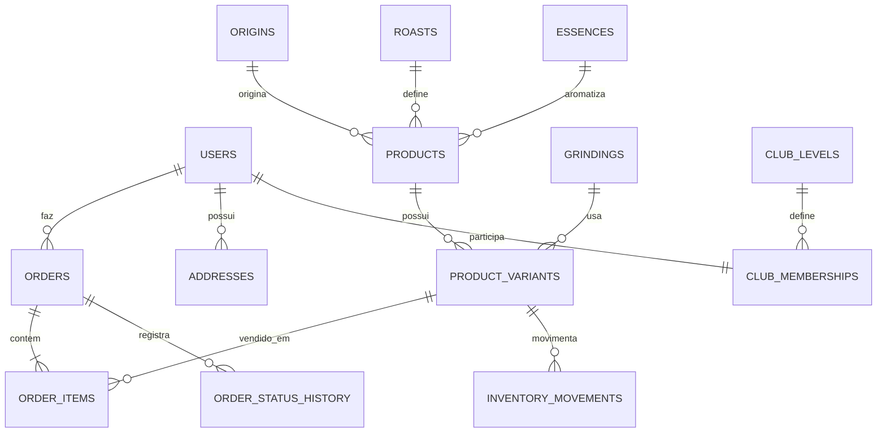

# Banco de dados

Entidades principais: users, addresses, origins, roasts, grindings, essences, categories, products, product_variants, inventory_movements, orders, order_items, order_status_history, stock_notifications, club_levels e club_memberships.

A relação central é: product → product_variants → order_items → orders. A baixa de estoque ocorre apenas no método de confirmação de pagamento, dentro de transação com bloqueio FOR UPDATE.

## ER resumido
